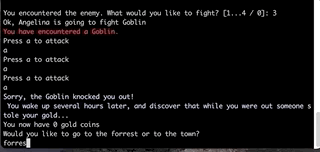

## Long Journey [Command Line Javascript Application]

A simple text based adventure game in which a user can fight a troll and if lucky to win, can find gold coins to spend in a local tavern. 




### Setup


1. Clone this repo to your machine `git@github.com:angelinaebreo/Long-Journey-CLI-Game.git`
1. Go into the cloned directory `$ cd Long-Journey-CLI-Game` and run `npm install`
1. Play and enjoy Snowman game! `$ node textBasedAdventure.js` 


### Dependecies
- **readlineSync** Used to communicate with the user via console
`const readline = require("readline-sync")`
```
readline.keyInYN("Would you like to play again? \n"
// User will enter Y or N to either replay or quit game
```
  
- **chalk** Used to edit text color
`const chalk = require("chalk")`


